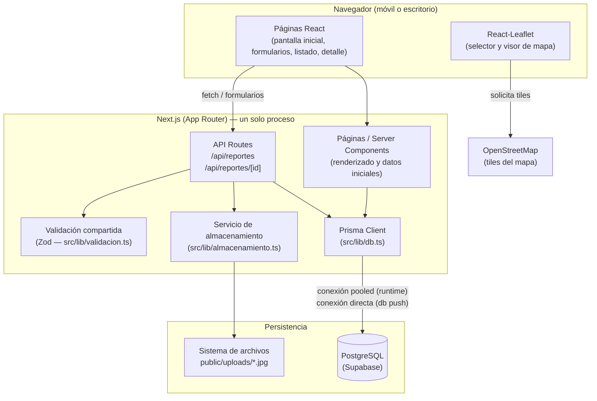
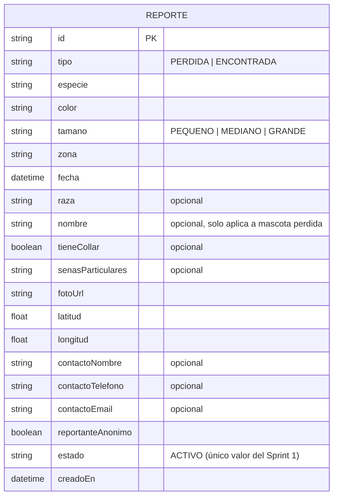
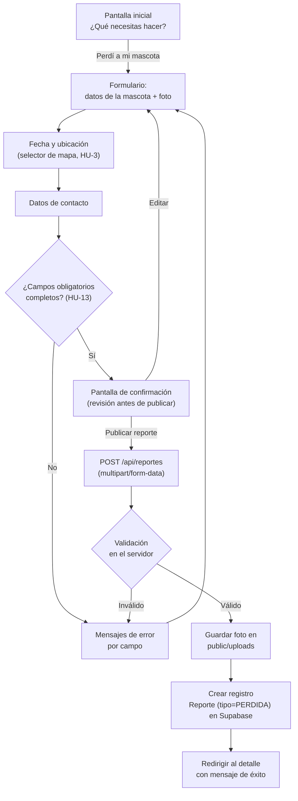
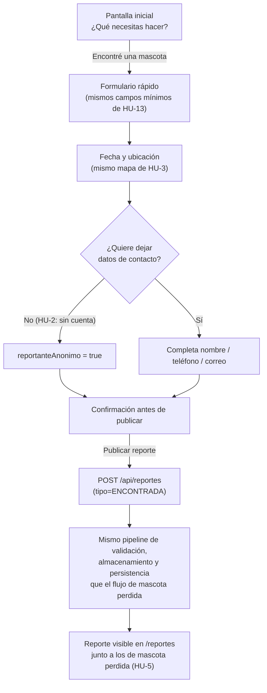

# Arquitectura — Sprint 1 (PetMatch)

> Nota sobre los diagramas: se generaron con Mermaid (texto embebido en este
> archivo) porque la skill `excalidraw-diagram` no está disponible en el
> entorno donde se construyó este Sprint. GitHub y la mayoría de visores de
> Markdown los renderizan de forma nativa sin instalar nada adicional.

## 1. Decisión de stack tecnológico

El repositorio estaba vacío, así que se seleccionó el stack desde cero.
Criterios de la decisión:

| Criterio | Por qué pesa | Elección |
|---|---|---|
| Facilidad de desarrollo | Proyecto académico, un solo equipo, tiempos cortos | Un único proyecto full-stack en vez de dos repos/servidores separados |
| Facilidad de demostración | Debe poder correr con pocos comandos en la sustentación | Un solo `npm run dev`, sin Docker, sin servicios externos de pago |
| Compatibilidad con mapas | HU-3 exige seleccionar y mostrar un punto geográfico | Leaflet + OpenStreetMap (gratuito, sin API key) |
| Manejo de fotografías | HU-1/HU-5 exigen adjuntar una foto | API Routes de Next.js reciben `multipart/form-data` de forma nativa |
| Base de datos | Debe persistir reportes de forma confiable y accesible desde cualquier equipo del curso | PostgreSQL administrado en **Supabase** vía Prisma ORM (sin servidor propio que mantener) |
| Escalabilidad | El backlog completo crecerá en sprints futuros | Postgres soporta el crecimiento del modelo (más tablas, más volumen) sin cambiar de motor; la subida de fotos está detrás de una única función reemplazable |
| Mantenibilidad | Código legible para un equipo académico | TypeScript de punta a punta + Zod como única fuente de verdad de validación |

**Stack elegido:** Next.js 14 (App Router) + TypeScript + Tailwind CSS +
Prisma ORM + PostgreSQL (Supabase) + React-Leaflet + Zod + Vitest.

Next.js se usa como aplicación **full-stack**: las páginas (frontend) y las
rutas `/api/*` (backend) conviven en el mismo proyecto y el mismo proceso.
Esto es una decisión de simplicidad para el Sprint 1, no una limitación
permanente: las rutas `api/reportes/*` están aisladas y podrían extraerse a
un servicio independiente más adelante sin rediseñar el resto de la app.

## 2. Diagrama de arquitectura general

### Responsabilidad de cada componente

- **Páginas / Server Components**: renderizan la pantalla inicial, el
  listado y el detalle consultando Prisma directamente en el servidor (sin
  saltos de red adicionales).
- **API Routes (`/api/reportes`)**: único punto de entrada para crear y
  consultar reportes; revalida los datos con el mismo esquema Zod que usa
  el formulario, así que el backend nunca confía ciegamente en el cliente.
- **Validación compartida (Zod)**: un solo esquema (`reporteSchema`) define
  qué es un reporte válido para HU-13; lo usan el formulario (validación
  inmediata) y la API (validación real, la que importa).
- **Servicio de almacenamiento**: aísla cómo y dónde se guarda una foto.
  Hoy escribe en disco; migrar a un proveedor externo (S3, Cloudinary) en
  un sprint futuro implica cambiar solo este archivo.
- **Prisma Client / Supabase (PostgreSQL)**: capa de persistencia. Se
  conecta a Supabase con dos cadenas: `DATABASE_URL` (pooler, puerto 6543)
  para las consultas normales de la app, y `DIRECT_URL` (conexión directa,
  puerto 5432) que Prisma usa solo para `db push` / `migrate`.
- **React-Leaflet + OpenStreetMap**: renderiza el mapa en el navegador y
  traduce clics en coordenadas (latitud/longitud) para HU-3.

## 3. Modelo de datos

Un único modelo `Reporte` diferenciado por el campo `tipo`, en vez de dos
tablas separadas para "perdida" y "encontrada": ambos casos comparten casi
todos los campos (HU-13), así que duplicar el modelo habría introducido
inconsistencias entre los dos flujos.

`tipo`, `tamano` y `estado` son **enums nativos de PostgreSQL**
(`TipoReporte`, `Tamano`, `EstadoReporte` en `schema.prisma`): la base de
datos rechaza cualquier valor fuera del conjunto cerrado, además de la
validación que ya hace Zod en la capa de aplicación
(`src/lib/validacion.ts`) — doble barrera contra datos inconsistentes. El
campo `estado` solo tiene el valor `ACTIVO` en este sprint: existe para
que un sprint futuro pueda agregar `REENCONTRADA` (HU-12) extendiendo el
enum, sin reconstruir el modelo.

## 4. Flujo — Registrar mascota perdida (HU-1, HU-13, HU-3)

## 5. Flujo — Registrar mascota encontrada (HU-2, HU-5)

Ambos flujos reutilizan el mismo componente de formulario
(`FormularioReporte`), el mismo esquema de validación y el mismo endpoint;
la diferencia entre "perdida" y "encontrada" es un parámetro (`tipo`), no
una implementación separada.

## 6. Seguridad y manejo de errores (Sprint 1)

- Ninguna clave ni secreto en el código: las cadenas de conexión a
  Supabase (`DATABASE_URL`, `DIRECT_URL`) viven únicamente en `.env`
  (ignorado por git), a partir de la plantilla `.env.example`.
- Validación en dos capas: cliente (feedback inmediato) y servidor
  (autoridad real — nunca se confía solo en el navegador).
- Las fotos se restringen por tipo MIME (`jpeg`, `png`, `webp`) y tamaño
  máximo (5 MB) antes de escribirse en disco.
- Errores de red o del servidor se muestran como mensajes claros en la UI
  (`error.tsx`, `not-found.tsx`, banners de error en el formulario), nunca
  como una pantalla en blanco o un stack trace.

## 7. Preparado para crecer (sin implementarlo en este sprint)

- El campo `estado` ya está listo para que un sprint futuro agregue el
  valor `REENCONTRADA` (HU-12) al enum existente, sin rediseñar el modelo.
- El servicio de almacenamiento (`almacenamiento.ts`) es la única pieza
  que debe cambiar para mover las fotos a un proveedor en la nube.
- Los campos `especie`, `color`, `tamano`, `zona`, `fecha` ya existen y son
  consultables, que es lo que necesitará HU-6 (filtros) en un sprint
  futuro — pero el Sprint 1 no implementa ningún filtro además del simple
  toggle Perdidas/Encontradas.
- Nada de esto es una historia implementada: son solo decisiones de
  modelo que evitan reescribir el sistema más adelante.
