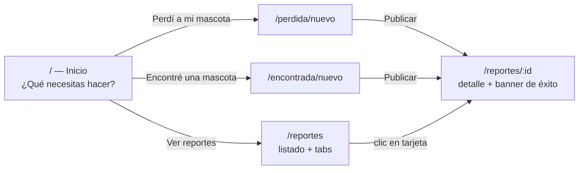

# Diseño de producto — Backend, Frontend, Base de datos, Interfaz y Roadmap de historias

> Este documento complementa a `docs/ARQUITECTURA.md` (que ya detalla el
> modelo de datos, RLS y Storage propuestos para Supabase). Aquí se
> consolida el diseño completo del sistema — backend, frontend, interfaz
> y la re-priorización de **todo** el Product Backlog en sprints — no solo
> el Sprint 1. Es un documento de **diseño/planeación**, no introduce
> ningún cambio en el código, la base de datos ni la infraestructura.

## 0. Stack tecnológico

| Capa | Tecnología | Por qué |
|---|---|---|
| Frontend + Backend | **Next.js 14** (App Router), TypeScript | Un solo proyecto full-stack: páginas y `/api/*` en el mismo proceso, ideal para el ritmo de un proyecto académico |
| Estilos | **Tailwind CSS** | Utilidades atómicas, consistencia visual rápida, buen soporte responsive |
| ORM / acceso a datos | **Prisma** | Tipado de extremo a extremo con TypeScript, migraciones versionadas, abstrae el motor de BD |
| Base de datos | **PostgreSQL administrado en Supabase** | Sin servidor propio que mantener; RLS, Storage y (a futuro) Auth nativos |
| Mapas | **React-Leaflet + OpenStreetMap** | Gratuito, sin API key, suficiente para seleccionar/mostrar un punto (HU-3) |
| Almacenamiento de fotos | **Supabase Storage** (bucket público `fotos-reportes`) | Evita guardar binarios en Postgres; URLs públicas servidas por Supabase |
| Validación | **Zod** | Un único esquema compartido entre formulario (cliente) y API (servidor) |
| Pruebas | **Vitest** | Rápido, ya integrado, cubre validación y almacenamiento |
| Cliente Supabase | **@supabase/supabase-js** (server-side, llave `anon`) | Solo para Storage por ahora; nunca la llave secreta |
| Autenticación (a partir del Sprint donde se necesite) | **Supabase Auth** | Ninguna historia de Sprint 1 la requiere; se introduce como habilitador cuando el backlog lo exija (ver sección 5) |

No se propone React Native / apps nativas todavía: el backlog completo (24 historias) se resuelve con una web responsive; "móvil" se cubre con diseño mobile-first, no con una app nativa separada. Si en algún sprint futuro se decide empaquetar como app (Capacitor, Expo, etc.), es una decisión a tomar en ese momento, no ahora.

## 1. Diseño de backend

El backend vive dentro del mismo proyecto Next.js, como **API Routes** (`src/app/api/**`). No hay un servicio separado.

### 1.1 Capas

```
Página / componente cliente
        │  fetch() / formData
        ▼
API Route (src/app/api/reportes/**)
        │
        ▼
Validación (Zod — src/lib/validacion.ts)   ← única fuente de verdad de "qué es un reporte válido"
        │
        ├──▶ Almacenamiento de fotos (src/lib/almacenamiento.ts) → Supabase Storage
        │
        ▼
Prisma Client (src/lib/db.ts) → PostgreSQL (Supabase)
```

### 1.2 Principios de diseño

- **Un único esquema de validación** (`reporteSchema`) usado tanto por el formulario (feedback inmediato) como por la API (autoridad real). Nunca se confía solo en lo que valida el navegador.
- **Los servicios de infraestructura están aislados detrás de una función**, no repartidos por las rutas: `almacenamiento.ts` para fotos, `db.ts` para la conexión a Prisma. Cambiar de proveedor de Storage o de motor de base de datos no debería tocar las rutas ni los componentes.
- **Sin lógica de negocio en los componentes de React** — las páginas y componentes solo arman el `FormData`/leen la respuesta; toda regla (qué es obligatorio, qué requiere contacto, qué tamaño de imagen se acepta) vive en `src/lib/`.
- **RLS como cinturón de seguridad, no como única barrera** (ver `docs/ARQUITECTURA.md` sección 6) — el backend Next.js sigue siendo el punto de validación principal.

### 1.3 Endpoints (Sprint 1, ya implementados)

| Método | Ruta | Función |
|---|---|---|
| `GET` | `/api/reportes` | Lista reportes, filtro opcional `?tipo=PERDIDA\|ENCONTRADA` |
| `POST` | `/api/reportes` | Crea un reporte (`multipart/form-data`: campos + foto) |
| `GET` | `/api/reportes/[id]` | Detalle de un reporte |

No existen (ni deben existir en Sprint 1) `PATCH`/`DELETE` — ninguna historia los requiere, y así la RLS de la sección H del informe anterior queda trivialmente correcta (nadie puede mutar ni borrar).

### 1.4 Qué cambia backend-wise al aprobar la fase de Supabase

- `almacenamiento.ts` deja de escribir en `public/uploads` y sube el archivo a Supabase Storage vía `@supabase/supabase-js`, devolviendo la **ruta** dentro del bucket (no la URL completa).
- `db.ts` sigue igual (Prisma), solo cambia el destino de `DATABASE_URL`/`DIRECT_URL`.
- Se agregan migraciones versionadas (`prisma/migrations/`) en vez de `db push`.

## 2. Diseño de frontend

### 2.1 Arquitectura de componentes (ya implementada)

```
src/app/
├─ page.tsx                     Pantalla inicial ("¿Qué necesitas hacer?")
├─ perdida/nuevo/page.tsx       → <FormularioReporte tipo="PERDIDA" />
├─ encontrada/nuevo/page.tsx    → <FormularioReporte tipo="ENCONTRADA" />
├─ reportes/page.tsx            Listado (server component, consulta Prisma directo)
└─ reportes/[id]/page.tsx       Detalle (server component) → <DetalleReporte />

src/components/
├─ FormularioReporte.tsx        Formulario compartido (2 pasos: datos → confirmación)
├─ MapaSelector.tsx             Cliente, Leaflet interactivo (clic / geolocalización)
├─ MapaVisor.tsx                Cliente, Leaflet de solo lectura
├─ CampoImagen.tsx              Input de foto con previsualización
├─ TarjetaReporte.tsx           Tarjeta del listado
└─ DetalleReporte.tsx           Vista de detalle completa
```

### 2.2 Decisiones de diseño frontend

- **Un componente de formulario, no dos**: `FormularioReporte` recibe `tipo` como prop y ajusta textos/campos (p. ej. "Nombre de la mascota" solo aplica a `PERDIDA`). Evita divergencia entre los dos flujos de HU-13.
- **Server Components por defecto**: listado y detalle consultan Prisma directamente en el servidor (sin round-trip extra a la API). Solo los componentes que necesitan interactividad (formulario, mapa, imagen) son `"use client"`.
- **Leaflet siempre con `next/dynamic(ssr:false)`**: Leaflet depende de `window`, así que nunca se renderiza en el servidor.
- **Un solo esquema de colores por tipo de reporte**: ámbar (`perdida-*`) y verde (`encontrada-*`) definidos en `tailwind.config.ts`, usados de forma consistente en botones, badges y pines del mapa — refuerza visualmente "estoy en el flujo de X" en toda la app.
- **Manejo de estado simple con `useState`**: no hay necesidad de una librería de estado global (Redux/Zustand) para el alcance actual; se reevaluará si Sprint 2+ introduce datos compartidos entre muchas pantallas (p. ej. sesión de usuario tras Auth).

### 2.3 Qué se prepara (sin construir) para sprints futuros

- La estructura por carpetas de ruta (`app/<seccion>/...`) ya admite agregar `app/reportes/[id]/editar/` o `app/cuenta/` sin reorganizar nada existente.
- El header (`layout.tsx`) tiene un solo link ("Ver reportes"); cuando exista Auth, ahí se agrega el estado de sesión (avatar/"Iniciar sesión") sin rediseñar el layout.

## 3. Diseño de base de datos

El detalle completo (tabla `reportes`, tipos de columna, constraints, índices, RLS, bucket de Storage) ya está desarrollado en **`docs/ARQUITECTURA.md`** y en el informe de la fase de análisis Supabase — no se repite aquí para no duplicar contenido que puede desincronizarse. Resumen ejecutivo:

- Una sola tabla `reportes`, sin tabla de usuarios (ninguna historia de Sprint 1 la requiere).
- Enums nativos de Postgres para `tipo`, `tamano`, `estado`.
- `latitud`/`longitud` como `double precision` (no PostGIS todavía — no hay historias de proximidad en Sprint 1).
- Fotos en Supabase Storage (bucket `fotos-reportes`), la tabla solo guarda la ruta.
- RLS habilitado: lectura e inserción pública, sin `UPDATE`/`DELETE` para nadie (coherente con que ninguna historia de Sprint 1 edita o borra reportes).

La sección 5 de este documento (roadmap) indica qué agrega cada sprint futuro a este modelo (nuevas tablas, nuevos campos, cuándo aparece Auth).

## 4. Diseño de interfaz (UX/UI)

### 4.1 Mapa de pantallas (Sprint 1, implementado)



### 4.2 Principios visuales

- **Español en toda la interfaz**, tono cercano pero profesional (no infantil, no corporativo-frío) — coherente con ser una herramienta usada en un momento de estrés (mascota perdida).
- **Color como código de estado**: ámbar = búsqueda en curso, verde = hallazgo — el usuario reconoce el tipo de reporte sin leer el badge.
- **Mobile-first**: formularios en una sola columna, mapa a ancho completo, botones grandes (objetivo táctil ≥ 44px) — la mayoría de reportes se crean desde la calle, con el celular.
- **Confirmación antes de publicar** en ambos flujos: nunca se envía nada a la API sin que la persona vea un resumen y decida "Publicar" explícitamente.
- **Errores en el lugar donde ocurren**: mensaje debajo del campo específico, no solo un banner genérico arriba.

### 4.3 Qué falta de interfaz para completar el backlog (no construido, documentado para más adelante)

- Pantalla de filtros (HU-6): barra de filtros sobre el listado actual, mismo layout de tarjetas.
- Badge "Reencontrada" (HU-12) sobre `TarjetaReporte` cuando el estado lo permita.
- Pantalla de perfil de mascota + QR (HU-8/9): nueva sección `/mascotas/`, fuera del flujo de reportes.
- Sesión/cuenta (header): solo aparece cuando el backlog lo requiera (sección 5).

## 5. Historias de usuario: usadas y por usar — roadmap por sprint

Se re-verificaron las 24 historias directamente en `Product Backlog.xlsx` (sin modificar ninguna). La priorización de Sprint 1 combinó el score de **Prioridad** con las **dependencias reales** entre historias (p. ej. HU-13 se adelantó pese a tener menor score porque HU-1/HU-2/HU-5 la necesitan). Este roadmap aplica la misma lógica a las 19 historias restantes: prioridad como señal principal, pero agrupando por dependencia técnica y por si comparten la misma infraestructura, para que cada sprint entregue un incremento coherente y demostrable.

| Sprint | HU | Historia (resumen) | Prioridad | Complejidad | Por qué va en este sprint |
|---|---|---|---|---|---|
| **1** ✅ | HU-1 | Registrar reporte de mascota perdida | 72 | 5 | Núcleo del producto |
| **1** ✅ | HU-2 | Registrar hallazgo sin cuenta | 72 | 4 | Núcleo del producto |
| **1** ✅ | HU-3 | Ubicar última vez en mapa | 72 | 6 | Núcleo del producto |
| **1** ✅ | HU-5 | Reportar mascota encontrada | 64 | 5 | Complementa HU-2 |
| **1** ✅ | HU-13 | Formulario con datos mínimos obligatorios | 42 | 3 | Habilitador técnico de HU-1/2/5 |
| **2** | HU-6 | Filtrar reportes (zona, especie, color, tamaño, fecha) | 56 | 4 | Hace usable el volumen de reportes que ya se pueden crear; sin dependencias nuevas |
| **2** | HU-12 | Marcar reporte como "reencontrada" | 48 | 2 | Muy barata, reduce ruido en el listado que HU-6 ya está filtrando |
| **2** | HU-21 | Compartir reporte en redes sociales | 20 | 2 | Casi gratis sobre lo ya construido, amplía alcance sin nueva infraestructura |
| **3** | HU-4 | Alerta de coincidencia automática | 72 | 8 | Empatada en la prioridad más alta del backlog; estaba bloqueada hasta que existieran ambos tipos de reporte (Sprint 1) — ahora es la de mayor valor pendiente |
| **3** | HU-15 | Advertir posibles reportes duplicados | 30 | 8 | Reutiliza el mismo motor de comparación que construye HU-4 |
| **3** | HU-19 | Mantener el reporte activo / redifusión | 24 | 5 | Parte del mismo ciclo de vida que alimenta las alertas de HU-4 |
| **4** | *(RECOMENDACIÓN, no es una historia del Excel)* | Introducir cuentas de usuario (Supabase Auth) | — | — | Habilitador técnico puro: HU-8, HU-9, HU-11 y HU-23 necesitan identidad persistente y ninguna historia oficial la define explícitamente |
| **4** | HU-23 | Actualizar datos de contacto y fotos | 15 | 2 | La más barata de las que dependen de cuentas; valida el enabler de inmediato |
| **5** | HU-8 | Perfil digital de mascota con QR imprimible | 48 | 6 | Requiere cuentas (Sprint 4); introduce la entidad "Mascota" persistente |
| **5** | HU-9 | Escanear QR de la placa | 48 | 5 | Consume directamente lo que crea HU-8 |
| **6** | HU-11 | Chat interno dueño↔hallador | 48 | 5 | Requiere cuentas; aísla su propia infraestructura (mensajería) de las demás |
| **7** | HU-7 | Comparación automática de fotos (IA) | 54 | 10 | La complejidad más alta del backlog entero; merece un sprint dedicado |
| **7** | HU-10 | Buscar por foto | 48 | 8 | Reutiliza el mismo modelo de IA que construye HU-7 |
| **8** | HU-14 | Listado unificado de refugios/comunidades | 35 | 5 | Introduce la entidad "Organización" (refugio/veterinaria) |
| **8** | HU-17 | Veterinaria vincula microchip | 24 | 6 | Comparte la entidad "Organización" de HU-14 |
| **8** | HU-18 | Ver refugios/veterinarias cercanas | 24 | 5 | Comparte la entidad "Organización" de HU-14 |
| **8** | HU-20 | Refugios publican mascotas bajo resguardo | 24 | 4 | Comparte la entidad "Organización" de HU-14 |
| **9** | HU-16 | Avisos de cercanía a ciudadanos | 30 | 5 | Requiere geolocalización de "seguidores", no solo de reportes |
| **9** | HU-22 | Dashboard administrativo de indicadores | 18 | 7 | Necesita el volumen de datos acumulado de los sprints anteriores para ser útil |
| **9** | HU-24 | Señas propias de felinos | 15 | 2 | Muy barata; se deja de relleno en el último sprint planeado |

**Nota sobre la fila "RECOMENDACIÓN" del Sprint 4:** no es una historia del Excel — es una necesidad técnica que identifico para poder construir HU-8/HU-9/HU-11/HU-23. Señalada explícitamente como tal, tal como pediste; no se implementará como si fuera una historia oficial del backlog.

Este roadmap es una propuesta de planeación, no un compromiso — cada sprint futuro debe repetir el mismo ejercicio de esta fase (verificar contra el Excel, confirmar Sprint Goal, esperar aprobación) antes de implementarse.
